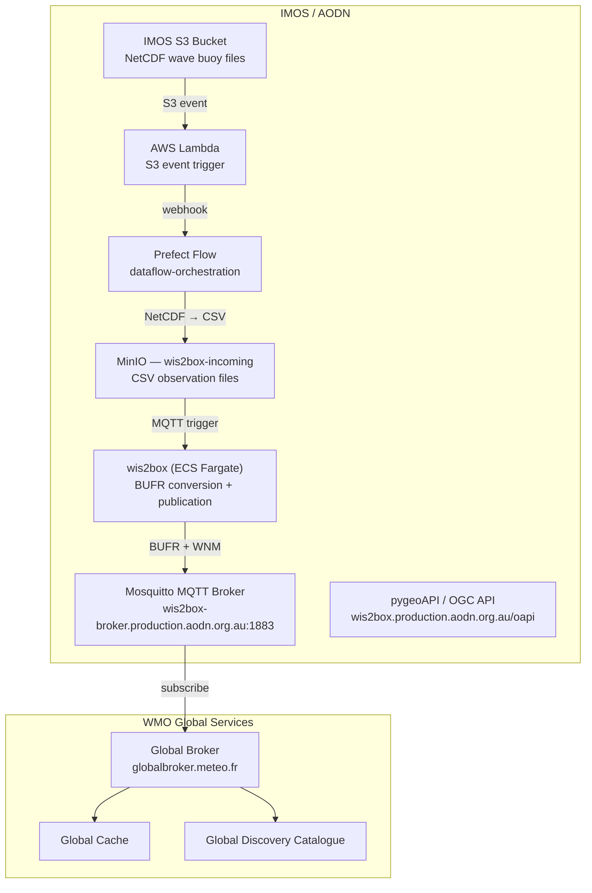

# IMOS WIS 2.0 Node — System Overview

The **Integrated Marine Observing System (IMOS)**, operated by the Australian Ocean Data Network (AODN), maintains a [WMO Information System 2.0 (WIS 2.0)](https://community.wmo.int/en/activity-areas/wis) node that publishes Australian coastal wave buoy observations to the global meteorological community.

This node is registered with the WMO under centre ID **`au-imos`** and distributes data openly under the [WMO Unified Data Policy](https://community.wmo.int/en/unified-data-policy) (`core` tier — free and unrestricted access).

---

## Architecture Overview



---

## Live Services

| Service | URL | Description |
|---|---|---|
| **WIS2 Webapp** | https://wis2box.production.aodn.org.au/wis2box-webapp/ | Admin interface — monitoring, station and dataset management |
| **OGC API (pygeoAPI)** | https://wis2box.production.aodn.org.au/oapi | Machine-readable access to stations, notifications, and observations |
| **MQTT Broker** | `mqtt://wis2box-broker.production.aodn.org.au:1883` | Real-time WIS2 notification stream (username: `everyone`, password: `everyone`) |
| **MinIO Console** | Internal (ECS) | S3-compatible object storage for incoming and published data |


---

## Data

**Dataset:** Coastal wave buoy observations  
**Stations:** 23 moored wave buoys around the Australian coast  
**Topic hierarchy:** `au-imos/data/core/ocean/surface-based-observations/wave-buoys`  
**Format:** NetCDF → CSV → BUFR4 → GeoJSON  
**Observation interval:** 60 minutes  
**Retention:** 30 days on the WIS2 node  

Measured parameters (BUFR descriptor 308015):

| Variable | Description |
|---|---|
| `WSSH` | Significant wave height (m) |
| `WPPE` | Spectral peak wave period (s) |
| `WPFM` | Mean wave period (s) |
| `WPDI` | Peak wave direction (°) |
| `SSWMD` | Mean wave direction (°) |
| `WMDS` / `WPDS` | Directional spread (°) |

---

## Repositories

| Repository | Purpose |
|---|---|
| **[wis2box-aodn](https://github.com/aodn/wis2box-aodn)** *(this repo)* | wis2box deployment configuration — station metadata, dataset mappings, discovery metadata MCF files, and operational scripts |
| **[dataflow-orchestration](https://github.com/aodn/dataflow-orchestration/tree/main/projects/wis2)** | Prefect-based upstream data pipeline — converts IMOS NetCDF files to CSV and uploads them to the wis2box MinIO incoming bucket |
| **[appdeploy](https://github.com/aodn/appdeploy/tree/main/tf/wis2)** | Terraform module that provisions the complete AWS infrastructure (ECS Fargate, ALB, NLB, CloudFront, EFS, Route 53) |
| **[wis2box](https://github.com/wmo-im/wis2box)** *(WMO)* | The WMO reference implementation of a WIS 2.0 Node — CSV→BUFR conversion, MQTT pub/sub, OGC API, and web UI |

---

## Repository Structure (`wis2box-aodn`)

```
wis2box-aodn/
├── wis2-pipeline/wis2box-data/
│   ├── metadata/discovery/          # MCF YAML — dataset discovery records
│   ├── metadata/station/            # station_list.csv — WIGOS station registry
│   ├── mappings/                    # wave_buoy_template.json — CSV→BUFR mapping
│   └── scripts/                     # publish/unpublish metadata scripts
├── wis2-terraform/                  # Terraform entry point (uses appdeploy module)
├── docs/                            # Technical documentation
│   ├── infrastructure.md            # AWS architecture, ECS task layout, Terraform details
│   ├── pipeline.md                  # Upstream data pipeline (dataflow-orchestration)
│   ├── pygeoAPI.md                  # OGC API usage guide and query examples
│   ├── walkthrough.md               # Step-by-step operational guide
│   └── mqtt_msg.md                  # WIS2 Notification Message format reference
└── resources/wis2-notebooks/        # Jupyter notebooks for data exploration
```

---

## Partners & Standards Bodies

| Organisation | Role |
|---|---|
| **[WMO](https://wmo.int)** | Defines WIS 2.0 standards; operates Global Broker, Global Cache, and Global Discovery Catalogue |
| **[Bureau of Meteorology (BOM)](http://www.bom.gov.au)** | Australia's WMO member; supports IMOS to register `au-imos` centre |
| **[IMOS](https://imos.org.au)** | Funds and operates the Australian ocean observing infrastructure |
| **[AODN](https://portal.aodn.org.au/)** | Manages the data portal and WIS 2.0 node deployment |
| **[OceanOPS](https://www.ocean-ops.org)** | Tracks WIGOS station registration and operational status |
| **[OSCAR/Surface](https://oscar.wmo.int/surface/)** | WMO registry for WIGOS station identifiers |

---

## Further Reading

| Document | Description |
|---|---|
| [`docs/infrastructure.md`](infrastructure.md) | Full AWS architecture diagram, ECS container layout, Terraform module details |
| [`docs/pipeline.md`](pipeline.md) | End-to-end data pipeline from IMOS S3 to WIS2 MQTT |
| [`docs/pygeoAPI.md`](pygeoAPI.md) | OGC API reference — querying stations, notifications, and downloading BUFR |
| [`docs/walkthrough.md`](walkthrough.md) | Step-by-step guide to publishing data through the IMOS WIS2 node |
| [`docs/mqtt_msg.md`](mqtt_msg.md) | WIS2 Notification Message (WNM) format and field definitions |
| [wis2box Documentation](https://docs.wis2box.wis.wmo.int/) | Official wis2box operator and developer guide |
| [WIS 2.0 Guide](https://guide.wis2box.wis.wmo.int/) | WMO WIS 2.0 technical guide |
