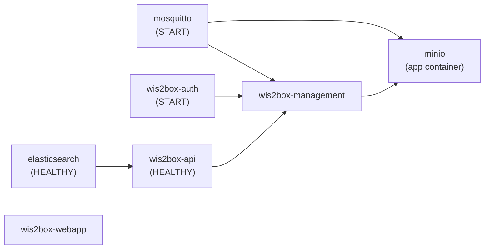

# WIS2 Infrastructure Deployment

The WIS2 infrastructure was deployed on AODN AWS account using Terraform code. The main code uses a Terraform module [appdeploy](https://github.com/aodn/appdeploy/tree/main/tf/wis2) that deploys a wis2box application container on AWS.
## Overview

The module provisions a complete, production-ready AWS stack covering:

- **Container hosting** — ECS Fargate cluster and service running the WIS2box application and Mosquitto MQTT broker
- **Message brokering** — Mosquitto (MQTT) broker exposed via a dedicated Network Load Balancer for WIS2 data exchange
- **Content delivery** — CloudFront CDN with WAF, HSTS, and custom error pages in front of the application
- **Persistent storage** — encrypted EFS volumes, an S3 config bucket, and an optional S3 data bucket with disaster-recovery replication
- **DNS** — Route 53 records for both the web application and the MQTT broker endpoint

The module is designed as a self-contained, reusable unit. All shared infrastructure (VPC, subnets, certificates, hosted zone, ALB) is resolved at plan/apply time via **AWS SSM Parameter Store** — no hard-coded account-specific values are required.

---

## Architecture Diagram

### AWS Infrastructure

The diagram below shows all AWS services deployed by this module and their relationships.

```mermaid
flowchart TD
    subgraph inet["🌐 Internet"]
        WebClient(["Web Browser\nHTTPS / HTTP"])
        MQTTClient(["MQTT Client\nTCP 1883"])
    end

    subgraph dns["Route 53"]
        R53App["A record\napp aliases → CloudFront"]
        R53Broker["A record\nbroker domain → NLB"]
    end

    subgraph cdn["CloudFront  (Global Edge — us-east-1)"]
        CF["CloudFront Distribution\n• aliases: wis2box.*.aodn.org.au\n• viewer protocol: HTTPS only\n• TLS 1.2+ SNI\n• access logs → S3 log bucket\n• /data/* → CloudFront Function\n  (modify path prefix)"]
        WAF(["WAF WebACL\n(shared, global)\n/apps/global/waf"])
        ACMGlobal(["ACM Wildcard Cert\nus-east-1\n/core/wildcard_id"])
        CFRespPolicy["Response Headers Policy\nHSTS: max-age=31536000\nincludeSubDomains; preload"]
        S3Err["S3: aodn-error-pages\n403.html (edge/staging/prod)\nvia shared OAC"]
    end

    subgraph public["Public Subnets  (×3 AZs)"]
        ALB["Application Load Balancer\n• HTTP:80 → HTTPS 301\n• HTTPS:443 TLS 1.3\n• shared or dedicated\n• deletion protection in prod"]
        ACMRegional(["ACM Wildcard Cert\nregional\n/core/wildcard_id"])
        NLB["Network Load Balancer\nnlb-wis2box-broker\nTCP:1883"]
    end

    subgraph alb_rules["ALB Listener Rules"]
        TG_Minio["TG: minio\nHTTP · port 9000\nGET /minio/health/live"]
        TG_Broker["TG: tg_broker\nTCP · port 1883"]
        TG_WebApp["TG: wis2box-webapp\nHTTP · port 4173\npath: /wis2box-webapp/*"]
        TG_API["TG: wis2box-api\nHTTP · port 80\npath: /oapi*"]
    end

    subgraph ecs["ECS Fargate Service  (Private Subnets ×3 AZs)  —  4 vCPU · 8 GiB"]
        subgraph task["ECS Task  (7 containers)"]
            Minio["minio\nport 9000 · 9001\nminio/minio:2024-08-03"]
            Mosquitto["mosquitto\nport 1883 · 8884\nwis2box-broker:1.0.0"]
            ES["elasticsearch\nport 9200\nelasticsearch:8.6.2\n512 MiB heap"]
            API["wis2box-api\nport 80\nwis2box-api:1.0.0\n(pygeoapi / OGC API)"]
            Mgmt["wis2box-management\nwis2box-management:1.0.0\n(pubsub subscriber)"]
            Auth["wis2box-auth\nport 8080\nwis2box-auth:1.0.0"]
            WebApp["wis2box-webapp\nport 4173\nwis2box-webapp:1.0.0"]
        end
        ASG["Auto Scaling\nCPU target: 50%\nmin 1 · max 10"]
    end

    subgraph storage["Storage (EFS — encrypted, backup enabled, ×3 AZs)"]
        EFS_ES[("wis2box-es-data\n/usr/share/elasticsearch/data")]
        EFS_Minio[("wis2box-minio-data\n/data")]
        EFS_Data[("wis2box-host-datadir\n/data/wis2box")]
        EFS_Auth[("wis2box-auth-data\n/data/wis2box")]
        EFS_Htpasswd[("wis2box-htpasswd\n/home/wis2box/.htpasswd")]
        EFS_SSH[("wis2box-minio-ssh-config\n/home/miniouser/.ssh")]
        EFS_Mappings[("wis2box-api-mappings\n/data/wis2box/mappings")]
    end

    subgraph s3["S3"]
        S3Cfg["Config Bucket\nappconfig-wis2box-{env}\nenv files (MD5-keyed)"]
    end

    subgraph config["Resolved at deploy time"]
        SSM["SSM Parameter Store\ncredentials · image digest\nVPC · subnets · certs · WAF"]
        GHCR["GitHub Container Registry\nghcr.io/world-meteorological-organization/"]
        DockerHub["Docker Hub / Elastic\nminio · elasticsearch"]
    end

    %% DNS
    WebClient -->|DNS| R53App
    MQTTClient -->|DNS| R53Broker
    R53App -->|A alias| CF
    R53Broker -->|A alias| NLB

    %% CDN → ALB
    WAF -. filters .-> CF
    ACMGlobal -. viewer cert .-> CF
    CFRespPolicy -. HSTS .-> CF
    CF -->|HTTPS origin| ALB
    CF -. 403 error page .-> S3Err

    %% ALB
    ACMRegional -. HTTPS cert .-> ALB
    ALB --> TG_Minio & TG_WebApp & TG_API
    NLB --> TG_Broker

    %% TGs → containers
    TG_Minio --> Minio
    TG_WebApp --> WebApp
    TG_API --> API
    TG_Broker --> Mosquitto

    %% Inter-container communication (localhost)
    Minio -->|"MQTT notify\ntcp://localhost:1883"| Mosquitto
    API -->|"backend\nlocalhost:9200"| ES
    Mgmt -->|"pubsub\nlocalhost:1883"| Mosquitto
    Mgmt -->|"API calls\nlocalhost:80"| API
    Mgmt -->|"auth check\nlocalhost:8080"| Auth
    WebApp -->|"API calls\nlocalhost:80/oapi"| API
    WebApp -->|"auth\nlocalhost:8080"| Auth
    Auth -->|"storage\nlocalhost:9000"| Minio

    %% EFS mounts
    ES --- EFS_ES
    Minio --- EFS_Minio
    Minio --- EFS_SSH
    Mgmt --- EFS_Data
    Mgmt --- EFS_Htpasswd
    Auth --- EFS_Auth
    API --- EFS_Mappings

    %% S3 config
    Minio -. env files at startup .-> S3Cfg

    %% Image pull
    GHCR -. image pull .-> Mosquitto & API & Mgmt & Auth & WebApp
    DockerHub -. image pull .-> Minio & ES

    %% SSM
    SSM -. secrets + infra refs .-> ecs
    SSM -. Terraform data sources .-> ALB

    %% Scaling
    ASG -. scales .-> task
```



### Container Startup Order

All 7 containers start inside the same ECS task. The `dependsOn` conditions enforce this startup sequence:



---

## Deployed Services

| Service | AWS Resource | Defined in | Purpose |
|---------|-------------|-----------|---------|
| ECS Cluster | `module.cluster` (`terraform-aws-modules/ecs`) | `cluster.tf` | Fargate cluster with Container Insights |
| ECS Service | `module.service` (`terraform-aws-modules/ecs`) | `service.tf` | Runs the task definition with autoscaling |
| Application Load Balancer | `module.alb` (`terraform-aws-modules/alb`) | `alb.tf` | HTTPS ingress, TLS termination, listener rules |
| Network Load Balancer | `module.nlb` (`terraform-aws-modules/alb`) | `nlb.tf` | TCP:1883 ingress for MQTT broker |
| CloudFront Distribution | `aws_cloudfront_distribution.this` | `cloudfront.tf` | CDN, WAF, HSTS, custom error pages |
| CloudFront Origin Request Policy | `aws_cloudfront_origin_request_policy` | `cloudfront.tf` | Controls headers/QS/cookies forwarded to ALB |
| CloudFront Response Headers Policy | `aws_cloudfront_response_headers_policy` | `cloudfront.tf` | Enforces HSTS on all responses |
| S3 Config Bucket | `module.config_bucket` | `bucket.tf` | Stores environment variable files for ECS |
| S3 Data Bucket | `module.data_bucket` | `bucket.tf` | Application data (optional) |
| S3 Replication | `aws_s3_bucket_replication_configuration` | `bucket.tf` | Cross-account DR replication (optional) |
| EFS Volumes | `module.efs_volumes` (`terraform-aws-modules/efs`) | `efs.tf` | Persistent container storage across 3 AZs |
| Route 53 — app record | `aws_route53_record.app` | `route53.tf` | A alias → CloudFront for each app hostname |
| Route 53 — broker record | `aws_route53_record.broker` | `route53.tf` | A alias → NLB for MQTT broker domain |
| ALB Target Group (app) | `aws_lb_target_group.app` | `alb.tf` | Routes HTTP traffic to app/nginx container |
| ALB Target Group (broker) | `aws_lb_target_group.tg_broker` | `nlb.tf` | Routes TCP:1883 to mosquitto container |
| ALB Target Group (extra) | `aws_lb_target_group.additional_public_tg` | `alb.tf` | Routes traffic to extra public containers |
| ALB Listener Rules | `aws_lb_listener_rule.*` | `alb.tf` | host-header + path-pattern matching rules |

---

## Key Components

### ECS Fargate Cluster (`cluster.tf`)

The ECS cluster is created with CloudWatch **Container Insights** enabled. It supports both `FARGATE` and `FARGATE_SPOT` capacity providers (50/50 weight by default).

The `create_cluster` variable lets you either create a dedicated cluster or attach the service to an existing one by providing its ARN via `cluster_arn`. A `null_resource` precondition enforces that exactly one of these options is set.

### ECS Fargate Service (`service.tf`)

The service runs the WIS2box task definition inside private subnets. Key configuration:

| Setting | Default | Notes |
|---------|---------|-------|
| Capacity provider | `FARGATE` (production) / `FARGATE_SPOT` (others) | Controlled by `var.environment` |
| CPU | 512 | Configurable via `var.cpu` |
| Memory | 1024 MiB | Configurable via `var.memory` |
| Autoscaling | Enabled, 1–10 tasks | CPU target tracking at 50% |
| Deployment | min 66%, max 200% healthy | Circuit breaker + auto rollback |
| ECS Exec | Enabled | Allows `aws ecs execute-command` for live debugging |
| Steady-state wait | Enabled | Terraform waits up to 15 min for deployment |

**Task container layout (7 containers, 4 vCPU / 8 GiB):**

| Container | Image | Port(s) | Role | EFS mounts |
|-----------|-------|---------|------|-----------|
| `minio` *(app container)* | `minio/minio:2024-08-03` | 9000 (API), 9001 (console) | S3-compatible object storage for all WIS2box data buckets. Publishes MQTT events to mosquitto when objects arrive | `wis2box-minio-data` → `/data`; `wis2box-minio-ssh-config` → `/home/miniouser/.ssh` |
| `mosquitto` | `wis2box-broker:1.0.0` | 1883 (MQTT), 8884 | WMO-customised Eclipse Mosquitto MQTT broker. Receives storage events from MinIO, publishes WIS2 notifications | — |
| `elasticsearch` | `elasticsearch:8.6.2` | 9200 | Single-node Elasticsearch (512 MiB heap). Search backend for `wis2box-api` | `wis2box-es-data` → `/usr/share/elasticsearch/data` |
| `wis2box-api` | `wis2box-api:1.0.0` | 80 | pygeoapi-based OGC API, serves `/oapi`. Exposed publicly via ALB. Depends on Elasticsearch being healthy | `wis2box-api-mappings` → `/data/wis2box/mappings` |
| `wis2box-management` | `wis2box-management:1.0.0` | — | Runs `wis2box pubsub subscribe` — the core WIS2box data pipeline. Processes incoming data from MQTT, validates, converts, and publishes WIS2 notifications | `wis2box-host-datadir` → `/data/wis2box`; `wis2box-htpasswd` → `/home/wis2box/.htpasswd` |
| `wis2box-auth` | `wis2box-auth:1.0.0` | 8080 | Token-based authentication service for WIS2box | `wis2box-auth-data` → `/data/wis2box` |
| `wis2box-webapp` | `wis2box-webapp:1.0.0` | 4173 | Vue.js web UI for monitoring, data management, and station configuration. Exposed publicly via ALB at `/wis2box-webapp/*` | — |

The ALB has **two** public-facing target groups for this task: `wis2box-api` (path `/oapi*`) and `wis2box-webapp` (path `/wis2box-webapp/*`). The NLB target group forwards TCP:1883 to the `mosquitto` container. The `minio` container is the task's primary container (health-checked by ALB at `/minio/health/live`).

**Security group rules** for the ECS service are tightly scoped:

| Direction | Port | Source/Destination | Reason |
|-----------|------|--------------------|--------|
| Ingress | 80 or 9000 | ALB security group | HTTP from load balancer |
| Ingress | 1883 | NLB security group | MQTT from broker load balancer |
| Ingress | varies | ALB security group | Additional public containers |
| Egress | 443 | 0.0.0.0/0 | Outbound HTTPS (ECR, SSM, S3 endpoints) |
| Egress | 2049 | VPC CIDR | NFS to EFS mount targets |

### Application Load Balancer (`alb.tf`)

The ALB operates in public subnets and handles all HTTP/HTTPS web traffic. It can be **created by this module** (default) or **shared** with other applications by setting `alb_parameter_name` to a key in SSM that holds an existing ALB's DNS name, listener ARN, security group ID, and zone ID.

**Listener rules** (evaluated in order):

1. `context_path` — if `var.context_path` is set, redirects bare `/` requests to the configured sub-path (HTTP 302)
2. `app_fgate` — host-header match per entry in `var.app_hostnames` → forwards to TG `app`
3. `cloudfront` — host-header match per entry in `var.additional_host_rules` (e.g. internal CloudFront hostnames) → forwards to TG `app`
4. `additional_listener_rule` — host + path-pattern match per `additional_public_containers` entry → forwards to its dedicated target group

### Network Load Balancer (`nlb.tf`)

A dedicated NLB named `wis2box-broker` (configurable via `nlb_name`) accepts raw TCP connections on port **1883** and forwards them to the `mosquitto` container in the ECS service. This port is the standard MQTT port used by WIS2 clients to subscribe to data notifications.

Deletion protection is enabled in production. The NLB is always created by this module (unlike the ALB, which can be shared).

### CloudFront Distribution (`cloudfront.tf`)

CloudFront serves as the public entry point for web traffic. It uses:

- A **global ACM wildcard certificate** (from `us-east-1`, fetched from SSM) for viewer connections
- A **shared WAF WebACL** (fetched from SSM `/apps/global/waf`) attached to the distribution
- The **ALB** as its primary origin (HTTPS-only, TLS 1.2+)
- Optional **additional origins** for other backends via `additional_origins`
- An **HSTS response headers policy** enforcing `max-age=31536000; includeSubDomains; preload`
- **CloudFront access logging** to `log-bucket-{account_id}`, prefixed by app/environment
- **Custom error page** for 403 responses (enabled automatically on edge/staging/production), served from an S3 origin via a shared Origin Access Control (OAC) fetched from SSM

The `default_cache_policy_id` defaults to the AWS-managed **CachingDisabled** policy — meaning CloudFront acts purely as a CDN shield and request router, not a cache.

### S3 Buckets (`bucket.tf`)

**Config Bucket** (`appconfig-{app}-{env}`):
- Always created; holds environment variable files placed in `environment_files/` alongside the Terraform code
- Files are uploaded as S3 objects with an MD5-hash prefix in the key — Terraform detects content changes and re-uploads automatically
- The ECS task execution role receives `s3:GetObject` and `s3:GetBucketLocation` permissions on this bucket
- Files are loaded into the container at startup via the ECS `environmentFiles` mechanism

**Data Bucket** (`data-{app}-{env}`, optional — `enable_data_bucket = true`):
- The ECS task role receives full CRUD permissions (`GetObject`, `PutObject`, `DeleteObject`, `ListBucket`, etc.)
- CORS rules can be applied via `data_bucket_cors_rules`
- Cross-account S3 replication to a DR account is supported via `enable_data_bucket_replication` — replicas are stored in GLACIER
- In the `edge` environment, `force_destroy = true` is set so the bucket can be deleted by Terraform without manual emptying

### EFS Volumes (`efs.tf`)

EFS volumes are defined as a map via `var.efs_volumes`. For each entry the module creates:

- An EFS file system (encrypted at rest, backup policy enabled by default)
- Mount targets in each of the three private subnets (one per AZ)
- EFS access points per the `access_points` map inside each volume definition
- A security group that only permits NFS ingress (port 2049) from the ECS service's security group

Volume configuration can be DRY'd up with `efs_defaults` — values set there apply to every volume unless overridden per-volume.

### Route 53 (`route53.tf`)

Two record types are created:

| Record | Type | Points to |
|--------|------|-----------|
| Per alias in CloudFront distribution that matches the hosted zone | A (alias) | CloudFront distribution |
| `var.broker_domain_name` | A (alias) | NLB DNS name |

The hosted zone is resolved from SSM (`/core/zone_domain`, `/core/zone_id`) — no zone ID needs to be passed in as a variable.

### SSM Parameter Store Integration (`parameters.tf`)

All account-level and environment-level values are consumed as **Terraform data sources** at plan/apply time. They are never stored in the module's state, keeping the module portable across accounts.

| SSM path | Used for |
|----------|---------|
| `/core/vpc_id` | VPC for all resources |
| `/core/vpc_cidr` | Security group CIDR rules |
| `/core/subnets_public` | ALB and NLB subnets |
| `/core/subnets_private` | ECS service and EFS subnets |
| `/core/zone_domain` | Route 53 hosted zone name |
| `/core/zone_id` | Route 53 hosted zone ID |
| `/core/wildcard_id/{domain}` | Regional ACM cert ARN for ALB |
| `/apps/global/waf` *(us-east-1)* | WAF WebACL ID for CloudFront |
| `/apps/global/oac/shared_s3_oac` *(us-east-1)* | Shared S3 OAC for CloudFront error pages |
| `/apps/global/wildcard_id/{domain}` *(us-east-1)* | Global ACM cert ARN for CloudFront |
| `/apps/alb/{name}/*` | Shared ALB details (when `alb_parameter_name` is set) |
| `/apps/{app}/{env}/image_digest` | ECR image digest (when `var.image` is empty) |

### Image Resolution

The module supports three ways to specify the container image:

1. **Digest string** (`image = "sha256:abc123..."`) — module prepends `{ecr_registry}/{ecr_repository}@`
2. **Full image URI** (`image = "123456789.dkr.ecr.ap-southeast-2.amazonaws.com/my-repo:tag"`) — used as-is
3. **SSM-resolved digest** (`image = ""`, default) — the module reads the digest from SSM at `/apps/{app}/{env}/image_digest` (or a custom `image_digest_parameter_name`). This enables **image-only deployments** via a separate CI/CD step that updates the SSM parameter — no Terraform re-run required.

---

## Environment-Specific Behaviour

| Setting | `edge` / `staging` | `production` |
|---------|--------------------|-------------|
| Capacity provider | `FARGATE_SPOT` (100%) | `FARGATE` (100%) |
| ALB/NLB deletion protection | Disabled | Enabled |
| CloudFront custom error page | Enabled | Enabled |
| S3 data bucket `force_destroy` | Enabled | Disabled |

---

## Usage

```hcl
module "wis2" {
  source = "path/to/tf/wis2"

  # Required
  app_name           = "wis2box"
  environment        = "production"
  aws_region         = "ap-southeast-2"
  ecr_repository     = "wis2box"
  broker_domain_name = "wis2-broker.example.aodn.org.au"

  # DNS / CDN
  app_hostnames = ["wis2.example.aodn.org.au"]
  aliases       = ["wis2.example.aodn.org.au"]

  # Compute
  cpu    = 1024
  memory = 2048

  # Environment files placed in ./environment_files/
  environment_files = ["wis2box.env"]

  # Persistent storage
  efs_volumes = {
    wis2box-data = {
      access_points = {
        root = {
          posix_user    = { uid = 1000, gid = 1000 }
          root_directory = { path = "/data" }
        }
      }
    }
  }

  # Optional: enable application data bucket
  enable_data_bucket = true

  # Optional: share an existing ALB
  # alb_parameter_name = "shared-alb"
}
```

---
