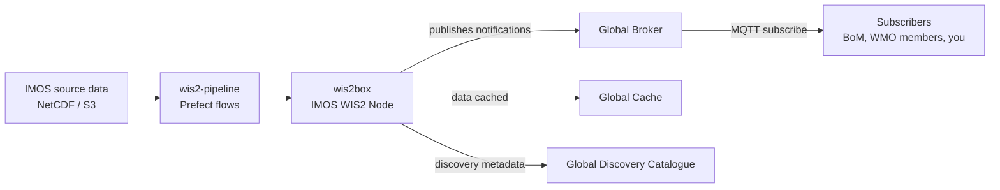
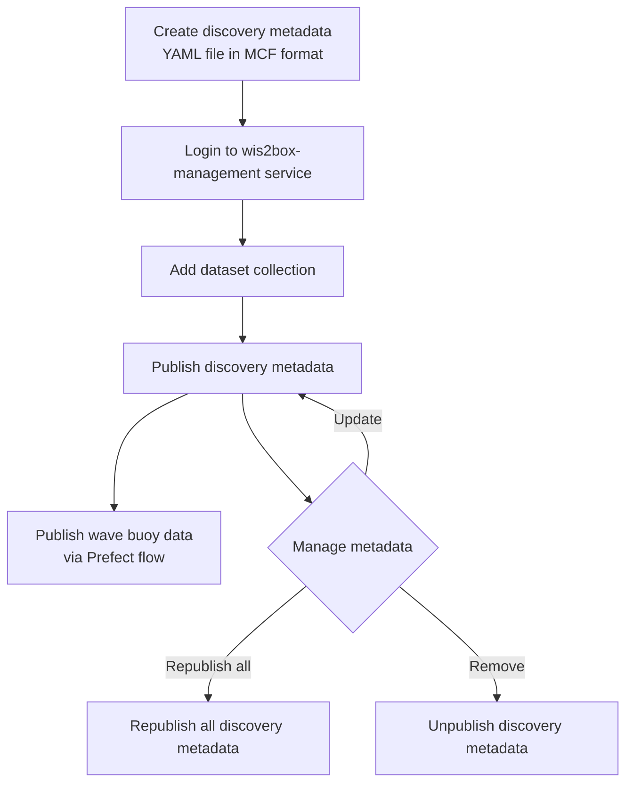

# IMOS WIS2 Workshop Outline

**Audience:** IMOS staff
**Duration:** TBD (suggested: half day — ~90 min presentation, ~2 h hands-on)
**Environment:** TBD — state explicitly whether exercises run against a sandbox/training wis2box node or the production Australian WIS2 node, and which exercises attendees perform themselves vs. follow along as a demo.

## 0. Prerequisites (send to attendees before the workshop)

1. Install [MQTT Explorer](https://mqtt-explorer.com/) and verify it launches
2. Connection details for the IMOS WIS2 broker (host, port, credentials) — verify connectivity from the IMOS network before the day
3. Access to the workshop wis2box environment (wis2box-webapp URL + login) — one set of credentials per attendee, or shared read-only + presenter publishes
4. Prefect access for the wave buoy flow exercise (or presenter-triggered)
5. Optional: clone this repo for the wis2-notebooks exercise

## 1. Introduction (presentation)

### 1.1 The WMO WIS2 System

1. What is WIS2 — WMO's replacement for GTS; publish/subscribe exchange of weather, climate, and ocean data
2. Why WIS2 — why IMOS participates, and what it means for IMOS data reaching the global community
3. How WIS2 works — the four building blocks: WIS2 Node, Global Broker, Global Cache, Global Discovery Catalogue
4. The WIS2 topic hierarchy — e.g. `origin/a/wis2/au-imos/...`; how topics map to datasets (needed to make sense of the MQTT exercises)
5. The Australian WIS2 Node operated by IMOS — role, scope, relationship to BoM/WMO
6. IMOS WIS2 services and how to subscribe (MQTT)

### 1.2 What IMOS publishes to WIS2

1. Datasets currently published (wave buoys, ...)
2. Why the data must be encoded as BUFR — one slide; format details live in §2.3 and Appendix A
3. Notification messages vs. data vs. discovery metadata — the three things that flow through WIS2

## 2. Architecture of the IMOS WIS2 System (presentation)

### 2.1 High-Level Architecture

The mental model the rest of the workshop hangs on — worth the most slide time.

- Components inside the IMOS node: wis2box-management, broker, storage, wis2box-webapp, geoapi
- Where the workshop exercises touch each component

### 2.2 Station Metadata and WIGOS IDs

Supports exercises 3.6–3.7.

1. What a WIGOS Station Identifier is and why every observing platform needs one
2. How IMOS wave buoy stations are registered
3. Publication flow of station metadata through wis2box

### 2.3 Publishing a Dataset: Wave Buoys End to End

One worked example carried through the rest of the workshop.

1. **Source:** `IMOS/COASTAL-WAVE-BUOYS/WAVE-BUOYS/REALTIME/WAVE-PARAMETERS/APOLLO-BAY` (NetCDF)
2. **Encoding:** 7 wave variables mapped to BUFR template **308015** (wave buoy) — show one example row (e.g. `WSSH` → `022070` significant wave height); full mapping table in [Appendix A](#appendix-a-netcdf--bufr-mapping-reference)
3. **Discovery metadata:** an MCF-format YAML file defines the dataset collection — identifier `urn:wmo:md:au-imos:wave-buoys`, topic hierarchy, retention, data mappings, contacts; details in [Appendix B](#appendix-b-discovery-metadata-mcf-reference)
4. **Publishing workflow:**

Note: discovery metadata (the dataset collection) must exist **before** data for that dataset can be published — the hands-on exercises follow this order.

## 3. Hands-On Exercises

Each exercise states a success criterion so attendees know they're done.

### 3.1 Connect to the IMOS WIS2 broker with MQTT Explorer
✅ Done when: connected and the `origin/a/wis2/au-imos/#` topic tree is visible.

### 3.2 Browse IMOS WIS2 notification messages via MQTT Explorer
Walk the topic hierarchy from §1.1; inspect a notification message payload.
✅ Done when: you can identify the dataset, data URL, and WIGOS ID inside a notification message.

### 3.3 Publish wave buoy discovery metadata to WIS2
Via wis2box-webapp, following §2.3 step 4. (Demo by presenter if attendees share one environment.)
✅ Done when: a metadata notification appears on the `.../metadata/...` topic in MQTT Explorer.

### 3.4 Trigger the Prefect flow for wave buoy data
✅ Done when: the flow run completes and data notifications appear in MQTT Explorer.

### 3.5 Browse the published wave buoy dataset via wis2box-webapp and geoapi
✅ Done when: the wave buoy collection and its observations render in both UIs.

### 3.6 Publish station metadata to WIS2
✅ Done when: the station appears with its WIGOS ID in wis2box.

### 3.7 Browse station metadata via wis2box-webapp and geoapi
✅ Done when: the station record is visible in the geoapi stations collection.

### 3.8 Explore the wis2-notebooks
Free exploration; suggested starting notebook: TBD.

## 4. Wrap-Up

1. Recap: what IMOS publishes, how it flows to the world, how to subscribe
2. Q&A
3. Where to learn more:
   - WMO WIS2 Guide: <https://community.wmo.int/en/activity-areas/wis>
   - wis2box documentation: <https://docs.wis2box.wis.wmo.int/>
   - This repository (`wis2-pipeline/`, discovery metadata, mapping templates)
   - wis2-notebooks

---

## Appendix A: NetCDF → BUFR Mapping Reference

Reference material for pipeline maintainers; not presented in full during the workshop.

BUFR template: **308015** (wave buoy).
Mapping template file: `wis2-pipeline/wis2box-data/mappings/wave_buoy_template.json`

### Source NetCDF variables

| NetCDF Variable | Standard Name | Long Name | Units |
|---|---|---|---|
| SSWMD | `sea_surface_wave_from_direction` | spectral sea surface wave mean direction | Degrees |
| WMDS | `sea_surface_wave_directional_spread` | spectral sea surface wave mean directional spread | Degrees |
| WPDI | `sea_surface_wave_from_direction_at_variance_spectral_density_maximum` | spectral peak wave direction | Degrees |
| WPDS | `sea_surface_wave_directional_spread_at_variance_spectral_density_maximum` | spectral sea surface wave peak directional spread | Degrees |
| WPFM | `sea_surface_wave_mean_period_from_variance_spectral_density_first_frequency_moment` | sea surface wave spectral mean period | s |
| WPPE | `sea_surface_wave_period_at_variance_spectral_density_maximum` | peak wave spectral period | s |
| WSSH | `sea_surface_wave_significant_height` | sea surface wave spectral significant height | m |
| WAVE_quality_control | — | primary Quality Control flag for wave variables | flag |

QC flag values follow **Ocean Data Standards, UNESCO 2013 (IOC Manuals and Guides, 54, Volume 3 Version 1)**:
`1=good, 2=not_evaluated, 3=questionable, 4=bad, 9=missing`

### Wave buoy mapping table (NetCDF → BUFR)

| NetCDF Name | WMO Table Ref | Element Name | Eccodes Key | Notes |
|---|---|---|---|---|
| SSWMD | 022086 | Mean direction from which waves are coming | `#1#meanDirectionFromWhichWavesAreComing` | |
| WMDS | 022187 | Directional spread of wave | `#1#directionalSpreadOfWaves` | Spread of "any wave" (022187) vs "dominant wave" (022077) |
| WPDI | 022076 | Direction from which dominant waves are coming | `#1#directionFromWhichDominantWavesAreComing` | ⚠️ Assumes peak wave ≈ dominant wave — needs verification before the workshop |
| WPDS | 022077 | Directional spread of dominant wave | `#1#directionalSpreadOfDominantWave` | |
| WPFM | 022074 | Average wave period | `#1#averageWavePeriod` | ⚠️ WMO table lacks "spectral mean period" — assumes equivalent; verify |
| WPPE | 022071 | Spectral peak wave period | `#1#spectralPeakWavePeriod` | |
| WSSH | 022070 | Significant wave height | `#1#significantWaveHeight` | |

## Appendix B: Discovery Metadata (MCF) Reference

The discovery metadata YAML defines the dataset collection:
`wis2-pipeline/wis2box-data/metadata/discovery/wave-buoys.yml`

Key sections of the MCF file:

- **wis2box** — retention policy, topic hierarchy, data mappings (csv2bufr, bufr2geojson plugins)
- **mcf** — MCF schema version
- **metadata** — unique identifier (`urn:wmo:md:au-imos:wave-buoys`) and hierarchy level
- **identification** — title, abstract, keywords, spatial/temporal extents, WMO data policy
- **contact** — host organisation details (IMOS)
