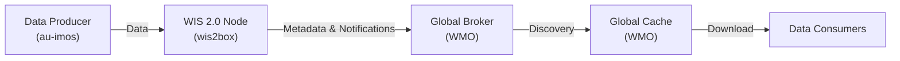
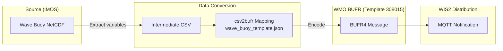
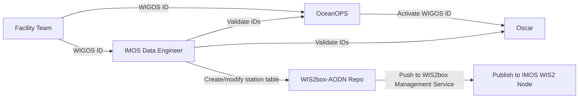
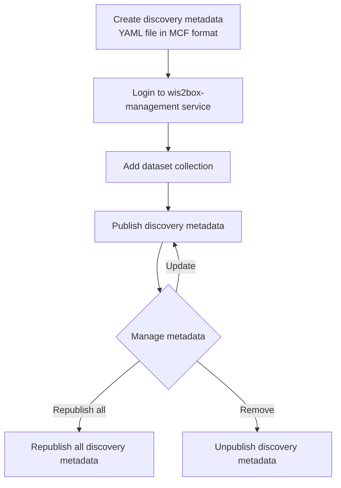
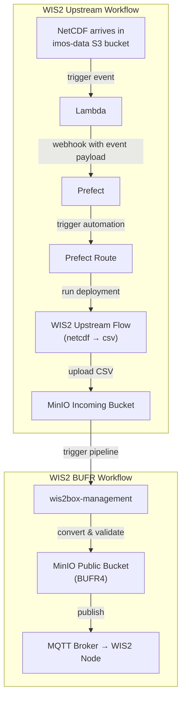

# WIS 2.0 & wis2box Workshop — AODN Staff

> **System under discussion:** `wis2box-aodn` — IMOS wave buoy observations published via the `au-imos` centre.

---

## 1. Introduction to WMO WIS 2.0

### 1.1 What is WIS 2.0?

The World Meteorological Organization (WMO) Information System 2.0 (WIS 2.0) replaces the legacy Global Telecommunication System (GTS) with a modern, web-friendly architecture for sharing weather, climate, and ocean data in real time.

| Design Goal | How WIS 2.0 Achieves It |
|---|---|
| **Open standards** | HTTP/HTTPS, MQTT, OGC APIs |
| **Pub/sub messaging** | Real-time notifications via MQTT brokers |
| **Machine-readable metadata** | WCMP2 discovery metadata (ISO 19115 profile) |
| **Decentralised** | Each centre runs its own WIS 2.0 node; Global Services aggregate |

### 1.2 Architecture at a Glance



**Key takeaway:** IMOS operates as a **data producer**. Our `wis2box-aodn` deployment is the WIS 2.0 Node that publishes wave buoy observations to the WMO network.

### 1.3 Topic Hierarchy

WIS 2.0 organises data using a **topic hierarchy** — a structured path that identifies who publishes what kind of data.

**Format:**

```
{centre_id}/data/{data_policy}/{earth_system_discipline}/{observation_type}/{dataset_name}
```

**AODN example:**

```
au-imos/data/core/ocean/surface-based-observations/wave-buoys
│        │    │    │     │                           │
│        │    │    │     │                           └─ Dataset name
│        │    │    │     └─ Observation type
│        │    │    └─ Earth system discipline
│        │    └─ WMO data policy (core = free & open)
│        └─ Literal "data"
└─ Centre ID registered with WMO
```

| Segment | Value | Meaning |
|---|---|---|
| Centre ID | `au-imos` | Integrated Marine Observing System, Australia |
| Data policy | `core` | Freely available under WMO Unified Data Policy |
| Discipline | `ocean` | Earth system discipline |
| Observation type | `surface-based-observations` | In-situ surface instruments |
| Dataset | `wave-buoys` | Coastal wave buoy measurements |

**How the topic hierarchy is used:**

- **MQTT topics:** Notifications are published to broker topics derived from this hierarchy.
- **Discovery metadata:** Links datasets to [WIS 2.0 catalogues](https://wis2-gdc.weather.gc.ca/collections/wis2-discovery-metadata/items).
- **Data storage:** MinIO bucket paths mirror the hierarchy for incoming/published data.

### 1.4 IMOS WIS2 Node Core Services

| Service | URL / Endpoint |
|---|---|
| MQTT Broker | `wis2box-broker.production.aodn.org.au:1883` (user: `wis2box`) |
| WIS2 Webapp | https://wis2.aodn.org.au/wis2box-webapp/ |
| WIS2 pygeoapi | https://wis2.aodn.org.au/oapi/ |

**References:**
- [WIS 2.0 Technical Regulations](https://community.wmo.int/en/activity-areas/wis)
- [WMO Unified Data Policy (Resolution 1, Cg-Ext 2021)](https://ane4bf-datap1.s3-eu-west-1.amazonaws.com/wmocms/s3fs-public/ckeditor/files/Cg-Ext2021-d04-1-WMO-UNIFIED-POLICY-FOR-THE-INTERNATIONAL-approved_en.pdf)

---

## 2. Data Formats

### 2.1 Source Data — IMOS Wave Buoy NetCDF

Source data files: [IMOS Coastal Wave Buoys](https://thredds5.production.aodn.org.au/thredds/catalog/IMOS/COASTAL-WAVE-BUOYS/WAVE-BUOYS/REALTIME/WAVE-PARAMETERS/catalog.html)

Source data format: NetCDF4 (`.nc`)

#### Source NetCDF Variables

| NetCDF Variable | Standard Name | Long Name | Units | Valid Range |
|---|---|---|---|---|
| SSWMD | `sea_surface_wave_from_direction` | spectral sea surface wave mean direction | Degrees | 0–360 |
| WMDS | `sea_surface_wave_directional_spread` | spectral sea surface wave mean directional spread | Degrees | 0–360 |
| WPDI | `sea_surface_wave_from_direction_at_variance_spectral_density_maximum` | spectral peak wave direction | Degrees | 0–360 |
| WPDS | `sea_surface_wave_directional_spread_at_variance_spectral_density_maximum` | spectral sea surface wave peak directional spread | Degrees | 0–360 |
| WPFM | `sea_surface_wave_mean_period_from_variance_spectral_density_first_frequency_moment` | sea surface wave spectral mean period | s | 0–50 |
| WPPE | `sea_surface_wave_period_at_variance_spectral_density_maximum` | peak wave spectral period | s | 0–50 |
| WSSH | `sea_surface_wave_significant_height` | sea surface wave spectral significant height | m | 0–100 |
| WAVE_quality_control | — | primary QC flag for wave variables | flag | 1–9 |

### 2.2 Target Data — WMO BUFR Format

**BUFR** (Binary Universal Form for the Representation of meteorological data) is the WMO standard binary format for exchanging observational data.

| Property | Benefit |
|---|---|
| Compact binary encoding | Efficient for transmission and storage |
| Self-describing | Each message carries its own table references |
| Internationally standardised | Interoperable across all WMO member states |
| Supports quality flags | Built-in metadata for data quality |

#### BUFR Message Structure

```
┌──────────────────────┐
│  Section 0: Indicator │  ← "BUFR" magic bytes
│  Section 1: Header    │  ← Data category, centre, timestamp
│  Section 3: Descriptors│ ← What parameters are encoded
│  Section 4: Data      │  ← Actual observation values
│  Section 5: End       │  ← "7777" end marker
└──────────────────────┘
```

### 2.3 Wave Buoy Mapping Table (NetCDF → BUFR)

BUFR Template: **3 08 015** (ocean wave spectral observations)

| NetCDF Name | WMO Table Ref | BUFR Element Name | Eccodes Key | Notes |
|---|---|---|---|---|
| SSWMD | 022086 | Mean direction from which waves are coming | `#1#meanDirectionFromWhichWavesAreComing` | |
| WMDS | 022187 | Directional spread of wave | `#1#directionalSpreadOfWaves` | "any wave" (022187) vs "dominant wave" (022077) |
| WPDI | 022076 | Direction from which dominant waves are coming | `#1#directionFromWhichDominantWavesAreComing` | Assumes peak wave ≈ dominant wave |
| WPDS | 022077 | Directional spread of dominant wave | `#1#directionalSpreadOfDominantWave` | |
| WPFM | 022074 | Average wave period | `#1#averageWavePeriod` | WMO table lacks "spectral mean period" — assumed equivalent |
| WPPE | 022071 | Spectral peak wave period | `#1#spectralPeakWavePeriod` | |
| WSSH | 022070 | Significant wave height | `#1#significantWaveHeight` | |

Mapping template: `wis2-pipeline/wis2box-data/mappings/wave_buoy_template.json`

BUFR template references (WMO CPDB SharePoint):
- Wave buoy template 308015
- Moored buoy template 315008

The BUFR template could save a lot of time and effort, as it is a standardized format for meteorological data. It is also self-describing, which means that it contains all the information needed to understand the data. Otherwise, we need go to [ECMWF website](https://confluence.ecmwf.int/display/ECC/WMO%3D41+element+table) to get the BUFR elements and prepare the mapping file manually.

### 2.4 Data Processing Pipeline



---

## 3. wis2box Reference Implementation

**wis2box** is the WMO's official open-source reference implementation for running a WIS 2.0 Node. It provides a complete, containerised stack for data ingest, conversion, publication, and discovery.

### 3.1 Component Architecture

```
┌─────────────────────────────────────────────────────────────┐
│                        wis2box stack                        │
│                                                             │
│                 ┌────────────────────────┐                  │
│                 │  wis2box-webapp        │                  │
│                 │  (admin interface)     │                  │
│                 └───────────┬────────────┘                  │
│                             │                               │
│  ┌──────────────────────────▼─────────────────────────────┐ │
│  │                  wis2box-api (pygeoapi)                 │ │
│  │              OGC API — Features / Records               │ │
│  └────────────────────────┬───────────────────────────────┘ │
│                           │                                 │
│  ┌────────────────────────▼───────────────────────────────┐ │
│  │              wis2box-management                         │ │
│  │    metadata publishing · data ingest · MQTT subscribe   │ │
│  └───────────┬────────────────────────────┬───────────────┘ │
│              │                            │                 │
│  ┌───────────▼──────┐         ┌───────────▼──────────────┐  │
│  │   Elasticsearch  │         │   Mosquitto (MQTT)       │  │
│  │   (search index) │         │   (message broker)       │  │
│  └──────────────────┘         └──────────────────────────┘  │
│              │                            │                 │
│  ┌───────────▼────────────────────────────▼──────────────┐  │
│  │                 MinIO (S3 storage)                     │  │
│  │         wis2box-incoming / wis2box-public              │  │
│  └────────────────────────────────────────────────────────┘  │
└─────────────────────────────────────────────────────────────┘
```

### 3.2 Service Breakdown

| Service | Container | Role |
|---|---|---|
| **wis2box-webapp** | `wis2box-webapp` | Admin web application |
| **wis2box-api** | `wis2box-api` | OGC API endpoint (pygeoapi), serves data & metadata |
| **wis2box-management** | `wis2box-management` | Core engine — subscribes to MQTT, processes data |
| **wis2box-auth** | `wis2box-auth` | Token-based auth for data ingest |
| **Elasticsearch** | `elasticsearch` | Backend index for API queries |
| **Mosquitto** | `mosquitto` | MQTT broker for pub/sub messaging |
| **MinIO** | `wis2box-minio` | S3-compatible object storage |

---

## 4. AODN Deployment: wis2box-aodn

### 4.1 Repository Layout

```
wis2box-aodn/
├── wis2box/                        # Docker Compose & runtime config
│   ├── docker-compose.yml          # Service definitions
│   ├── wis2box.env.example         # Environment template
│   └── wis2box-ctl.py              # Control script
├── wis2-pipeline/wis2box-data/     # Data pipeline configuration
│   ├── metadata/
│   │   ├── discovery/wave-buoys.yml   # Dataset discovery metadata (MCF)
│   │   └── station/station_list.csv   # WIGOS station registry
│   ├── mappings/
│   │   └── wave_buoy_template.json    # CSV→BUFR mapping template
│   └── scripts/
│       ├── publish_metadata.sh        # Publish metadata to wis2box
│       └── unpublish_metadata.sh      # Remove published metadata
├── wis2-terraform/                 # AWS infrastructure (Terraform)
└── docs/                           # Documentation & workshop materials
```

### 4.2 Infrastructure (Terraform / AWS)

| Resource | Purpose |
|---|---|
| ECS Fargate cluster & service | Runs the 7-container wis2box task (4 vCPU / 8 GiB) with auto-scaling |
| Application Load Balancer | HTTPS ingress, TLS termination, listener rules for webapp and API |
| Network Load Balancer | TCP:1883 ingress for the Mosquitto MQTT broker |
| CloudFront distribution | CDN with WAF, HSTS, and custom error pages |
| EFS volumes (×7, encrypted) | Persistent container storage across 3 Availability Zones |
| S3 config bucket | Stores environment variable files loaded into containers at startup |
| Route 53 records | A-alias records for the web app (→ CloudFront) and broker (→ NLB) |
| SSM Parameter Store | Shared infrastructure references (VPC, subnets, certs, WAF) |

> See [`docs/infrastructure.md`](infrastructure.md) for full architecture diagrams and deployment details.

### 4.3 Station Network

The deployment currently registers **23 wave buoy stations** around the Australian coast:

| Region | Example Stations |
|---|---|
| Victoria | Apollo Bay, Central, Cape Bridgewater, Wilsons Prom |
| Tasmania | Storm Bay |
| Western Australia | Coral Bay, Shark Bay, Hillarys, Ocean Beach, Torbay West |
| South Australia | Brighton, North Kangaroo Island, Robe, Ceduna |
| New South Wales | Wooli, Collaroy-Narrabeen, Bengello, Tathra |
| Queensland | Karumba, Mission Beach |
| Northern Territory | Fenton Patches, Maningrida |

All stations use WIGOS identifiers: `0-{issuer}-0-{station_id}` (e.g. `0-22000-0-7811080` for Apollo Bay).

> **⚠ WIGOS ID is mandatory.** WIS2 cannot publish data without a registered WIGOS ID.
> Verify IDs on [OSCAR](https://oscar.wmo.int/surface/) and [OceanOPS](https://www.ocean-ops.org/).

---

## 5. WIGOS Station Registration

### 5.1 Publication Flow



### 5.2 Station Metadata Format

File: `wis2-pipeline/wis2box-data/metadata/station/station_list.csv`

```csv
station_name,wigos_station_identifier,traditional_station_identifier,facility_type,latitude,longitude,elevation,barometer_height,territory_name,wmo_region
APOLLO-BAY,0-22000-0-7811080,7811080,seaFixed,-38.7541,143.7232,0,0,AUS,southWestPacific
```

Key fields:
- **`wigos_station_identifier`** — Globally unique station ID registered with OSCAR/Surface.
- **`facility_type`** — All buoys are `seaFixed` (moored platforms).
- **`wmo_region`** — All Australian stations fall under `southWestPacific`.

### 5.3 Publishing Station Metadata

#### Method 1: Via wis2box-webapp (Manual)

1. Create an authorization token for `collections/stations`:
   ```bash
   cd ~/wis2box
   python3 wis2box-ctl.py login
   wis2box auth add-token --path collections/stations <TOKEN>
   ```
2. In wis2box-webapp → enter WIGOS ID → Search → confirm station info from OSCAR.
3. Select the corresponding topic for the station.
4. Enter the `collections/stations` token → Save and Publish.

#### Method 2: Via wis2box-management CLI (CSV)

```bash
cd ~/wis2box
python3 wis2box-ctl.py login

wis2box metadata station publish-collection \
    -p /data/wis2box/metadata/station/station_list.csv \
    -th origin/a/wis2/au-imos/data/core/ocean/surface-based-observations/wave-buoys
```

---

## 6. Discovery Metadata Management

The metadata consists of two components defined by WMO standards:
- **Station Metadata** — characteristics and details of observation stations.
- **Dataset Discovery Metadata** — enables users to find and understand datasets.

### 6.1 Discovery Metadata (MCF geo-YAML Format)

**MCF (Metadata Control File)** is a lightweight YAML-based format used by **pygeometa** to manage geospatial metadata. Instead of editing complex XML (ISO 19115) or JSON (WCMP2) directly, you maintain this human-readable YAML as the "source of truth." `wis2box` then uses it to generate the standardized discovery records required for the WMO Global Discovery Catalogue.

File: `wis2-pipeline/wis2box-data/metadata/discovery/wave-buoys.yml`

```yaml
wis2box:
    retention: P30D                          # Keep data for 30 days
    topic_hierarchy: au-imos/data/core/ocean/surface-based-observations/wave-buoys
    country: AUS
    centre_id: au-imos
    data_mappings:
        plugins:
            csv:
                - plugin: wis2box.data.csv2bufr.ObservationDataCSV2BUFR
                  template: wave_buoy_template
                  notify: true
                  file-pattern: '.*\.csv$'
            bufr4:
                - plugin: wis2box.data.bufr2geojson.ObservationDataBUFR2GeoJSON
                  file-pattern: '.*\.bufr4$'

metadata:
    identifier: urn:wmo:md:au-imos:wave-buoys   # Globally unique dataset URN
    hierarchylevel: dataset

identification:
    title: Wave buoy observations made as part of the -- IMOS-WIS2.0
    wmo_data_policy: core                        # Free and unrestricted access
    extents:
        spatial:
            - bbox: [112.0, -44.0, 155.0, -10.0]   # Australian coastal waters
        temporal:
            - begin: 2025-08-30
              resolution: PT30M                      # 30-minute observation interval
```

### 6.2 Publishing Discovery Metadata

#### Method 1: Via wis2box-webapp (Manual)

1. Create an authorization token for `processes/wis2box` after login the WIS2 management service:
   ```bash
   wis2box auth add-token --path processes/wis2box <TOKEN>
   ```
or ask WIS2box admin (LeoLi) for the token.

2. In wis2box-webapp → click **Dataset Editor**.
3. Set Centre ID (`au-imos`), Data Type → `other`.
4. Fill in title, keywords, description, temporal/spatial extents, and contact info.
5. Configure data mappings with `wave_buoy_template`.
6. Enter the `processes/wis2box` token → Submit.

#### Method 2: Via wis2box-management CLI (geo-YAML)

This method keeps the discovery metadata in a persistent, version-controlled way.

```bash
# Add the dataset collection
wis2box data add-collection /data/wis2box/metadata/discovery/wave-buoys.yml

# Publish discovery metadata
wis2box metadata discovery publish /data/wis2box/metadata/discovery/wave-buoys.yml
```

Or run the publish script directly:

```bash
cd /data/wis2box/scripts/
bash publish_metadata.sh
```

### 6.3 Publishing Workflow



### 6.4 Metadata Management CLI Reference

```
Usage: wis2box metadata discovery [OPTIONS] COMMAND [ARGS]...
  Discovery metadata management
Commands:
  publish    Inserts or updates discovery metadata to catalogue
  republish  Republish all published discovery metadata
  setup      Initializes metadata repository
  unpublish  Deletes a discovery metadata record from the catalogue

Usage: wis2box metadata station [OPTIONS] COMMAND [ARGS]...
  Station metadata management
Commands:
  add-topic           Adds topic to station metadata
  get                 Queries OSCAR/Surface for station information
  publish-collection  Publish from station_list.csv
  setup               Initializes metadata repository

Usage: wis2box data [OPTIONS] COMMAND [ARGS]...
  Data workflow
Commands:
  add-collection            Add collection index to API backend
  add-collection-items      Add collection items to API backend
  clean                     Clean data from storage older than X days
  delete-collection         Delete collection from API backend
  ingest                    Ingest data file or directory
  reindex-collection-items  Reindex items from one collection to another
```

---

## 7. End-to-End Data Pipeline

### 7.1 Upstream Workflow (Prefect)



### 7.2 End-to-End Data Flow

```
  IMOS wave buoys (NetCDF on S3)
        │
        ▼
  Lambda + Prefect automation
        │
        ▼
  Upstream flow: NetCDF → CSV
  (extract latest observation, map to WIGOS ID)
        │
        ▼
  Upload to MinIO (wis2box-incoming bucket)
  path: urn:wmo:md:au-imos:wave-buoys/
        │
        ▼
  wis2box-management detects new file (MQTT event)
        │
        ▼
  csv2bufr plugin converts CSV → BUFR4
  using wave_buoy_template.json
        │
        ├──► BUFR file stored in wis2box-public bucket
        │
        ├──► bufr2geojson converts to GeoJSON
        │    └──► Indexed in Elasticsearch → served via OGC API
        │
        └──► WIS 2.0 notification published to MQTT broker
             topic: origin/a/wis2/au-imos/data/core/ocean/surface-based-observations/wave-buoys
```

### 7.3 Dataset Configuration

Wave buoy datasets are configured in `projects/wis2/WAVE_BUOYS.yaml`:

```yaml
minio_path: urn:wmo:md:au-imos:wave-buoys

targets:
  - name: APOLLO_BAY
    match_on:
      prefix: IMOS/COASTAL-WAVE-BUOYS/WAVE-BUOYS/REALTIME/WAVE-PARAMETERS/APOLLO-BAY/
    wigos_id: 0-22000-0-7811080
```

- `minio_path` — Base path in the wis2box MinIO bucket.
- `targets[].match_on.prefix` — S3 path prefix to match incoming files.
- `targets[].wigos_id` — WIGOS station identifier for the output CSV.

---

## 8. Walkthrough: Publishing Data

### Step 1 — Start the Stack

```bash
cd wis2box
python wis2box-ctl.py start
```

### Step 2 — Publish Metadata

```bash
# Publish station list
docker exec wis2box-management \
    wis2box metadata station publish-collection \
    -p /data/wis2box/metadata/station/station_list.csv \
    -th origin/a/wis2/au-imos/data/core/ocean/surface-based-observations/wave-buoys

# Publish discovery metadata
docker exec wis2box-management \
    wis2box metadata discovery publish \
    /data/wis2box/metadata/discovery/wave-buoys.yml
```

### Step 3 — Ingest Observation Data

**Via MinIO client (mc):**

```bash
mc cp observation.csv \
    wis2box/wis2box-incoming/urn:wmo:md:au-imos:wave-buoys/
```


### Step 4 — Verify

```bash
# Check the API for published observations
curl -s https://wis2.aodn.org.au/oapi/collections | python -m json.tool

# Subscribe to MQTT notifications
mosquitto_sub -h wis2box-broker.production.aodn.org.au -t "origin/a/wis2/au-imos/#" -v
```

---

## 9. Operational Tips

### Logging into wis2box-management (ECS)

```bash
# Install AWS Session Manager plugin if needed
# Login to AWS edge account
export AWS_PROFILE=edge-admin
aws sso login

# Connect to ECS container
aws ecs execute-command \
  --region ap-southeast-2 \
  --cluster wis2box-edge \
  --task <TASK_ID> \
  --container wis2box-management \
  --command "sh" \
  --interactive
```

### MinIO Client (mc) Operations

```bash
# Set up alias
mc alias set wis2-aodn https://wis2box.edge.aodn.org.au ACCESS_KEY SECRET_KEY

# List objects
mc ls wis2-aodn/wis2box-public/

# Upload a test CSV
mc cp test.csv wis2-aodn/wis2box-incoming/urn:wmo:md:au-imos:wave-buoys/

# Delete old data
mc rm -r --force wis2-aodn/wis2box-public/2025-08-27/
```

### Unpublishing Metadata

```bash
# Via script
cd /data/wis2box/scripts/
bash unpublish_metadata.sh

# Or manually
wis2box metadata discovery unpublish urn:wmo:md:au-imos:wave-buoys
wis2box data delete-collection urn:wmo:md:au-imos:wave-buoys
```

### Prepare Metadata on Fresh ECS Provision

```bash
cd /data/wis2box
git clone https://github.com/aodn/wis2box-aodn.git
mv wis2box-aodn/wis2-pipeline/wis2box-data/metadata metadata
mv wis2box-aodn/wis2-pipeline/wis2box-data/mappings mappings
mv wis2box-aodn/wis2-pipeline/wis2box-data/scripts scripts
rm -rf wis2box-aodn

# Add topic for wave buoys
wis2box metadata station add-topic \
    origin/a/wis2/au-imos/data/core/ocean/surface-based-observations/wave-buoys
```

---

## 10. Key Concepts Summary

| Concept | In Our Deployment |
|---|---|
| **WIS 2.0 Node** | `wis2box-aodn` Docker stack |
| **Centre ID** | `au-imos` |
| **Data policy** | `core` (open) |
| **Topic hierarchy** | `au-imos/data/core/ocean/surface-based-observations/wave-buoys` |
| **Data format** | NetCDF → CSV → BUFR4 → GeoJSON |
| **Station IDs** | WIGOS format `0-{issuer}-0-{id}` |
| **Metadata standard** | MCF (YAML) / ISO 19115 / WCMP2 |
| **Message broker** | Mosquitto (MQTT) |
| **Object storage** | MinIO (S3-compatible) |
| **API** | OGC API via pygeoapi |
| **Observation interval** | Every 30 minutes (`PT30M`) |

---

## 11. Further Reading & Resources

### Official Documentation

- [wis2box Documentation](https://docs.wis2box.wis.wmo.int/)
- [wis2box GitHub Repository](https://github.com/wmo-im/wis2box)
- [WIS 2.0 Guide](https://guide.wis2box.wis.wmo.int/)
- [WMO WIS 2.0 Standards](https://community.wmo.int/en/activity-areas/wis)

### AODN / IMOS

- [IMOS Homepage](https://imos.org.au/)
- [AODN Portal](https://portal.aodn.org.au/)
- [THREDDS Catalogue — Wave Buoys](https://thredds.aodn.org.au/thredds/catalog/IMOS/COASTAL-WAVE-BUOYS/WAVE-BUOYS/REALTIME/WAVE-PARAMETERS/catalog.html)

### Tools

- [csv2bufr — CSV to BUFR converter](https://github.com/wmo-im/csv2bufr)
- [pywis-pubsub — WIS 2.0 pub/sub client](https://github.com/wmo-im/pywis-pubsub)
- [OSCAR/Surface — WMO station registry](https://oscar.wmo.int/surface/)
- [OceanOPS](https://www.ocean-ops.org/)

### This Repository

- [`wis2-pipeline/wis2box-data/README.md`](wis2-pipeline/wis2box-data/README.md) — Detailed metadata management docs
- [`wis2box/wis2box.env.example`](wis2box/wis2box.env.example) — Environment configuration reference
- [`docs/pipeline_README.md`](docs/pipeline_README.md) — Prefect upstream pipeline documentation