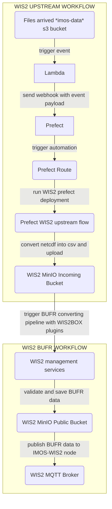

# IMOS WIS2.0
## Overview

This project contains the Prefect flow for processing IMOS buoy data for the WMO Information System 2.0 (WIS2). The `wis2_buoys_upstream_flow` is designed to be triggered by new NetCDF files arriving in an S3 bucket. It converts these files into CSV format and uploads them to a MinIO bucket, which acts as an incoming directory for a wis2box instance.

## Workflows


## Workflow Explained

The process is divided into two main parts as illustrated in the diagram above:

### WIS2 Upstream Workflow (This project)

1.  **File Arrival**: A new NetCDF data file lands in the `imos-data` S3 bucket.
2.  **Lambda Trigger**: An S3 event notification triggers a Lambda function.
3.  **Prefect Webhook**: The Lambda function sends a webhook to a Prefect Cloud endpoint, carrying the S3 event payload (bucket name and file key).
4.  **Prefect Automation**: An automation in Prefect Cloud is triggered by the webhook. It parses the payload and initiates a run of the `wis2_buoys_upstream_flow`.
5.  **Data Processing**: The flow reads the NetCDF file, extracts the latest data point, and converts it into a CSV format compliant with wis2box requirements.
6.  **MinIO Upload**: The resulting CSV file is uploaded to the `wis2box-incoming` bucket in a MinIO instance, ready for wis2box to process.

### WIS2 BUFR Workflow (wis2box)

This part of the workflow is handled by the [wis2box](https://github.com/wmo-im/wis2box) software.

1.  **wis2box Trigger**: wis2box continuously monitors the `wis2box-incoming` bucket. The new CSV file triggers a processing pipeline.
2.  **Data Conversion & Validation**: wis2box uses its plugins to convert the CSV data into the BUFR format. It validates the data against station metadata.
3.  **Public Storage**: The generated BUFR file is stored in a public MinIO bucket.
4.  **Data Publication**: The new BUFR data now can be made available to the Global Broker via MQTT based on the registered station and discovery metadata.

## Configuration

### Dataset Configuration

Each buoy dataset requires a YAML configuration file in the `projects/wis2/` directory (e.g., `APOLLO_BAY.yaml`). This file defines how the data for a specific station should be processed.

```yaml
config_id: APOLLO-BAY
wigos_id: 0-22000-0-7811080
minio_path: urn:wmo:md:au-bom-imos:wave-buoy-apollo-bay
```

-   `config_id`: A unique identifier for the dataset configuration. This is used to load the correct configuration in the Prefect flow.
-   `wigos_id`: The WIGOS station identifier for the buoy. This is used in the output CSV file.
-   `minio_path`: The base path for the data in the wis2box MinIO bucket.

### Prefect Configuration

The flow requires the following Prefect variables and secrets to be configured in your Prefect workspace:

-   **Variables**:
    -   `wis2_minio_storage_endpoint`: The endpoint URL for the MinIO storage.
    -   `wis2_minio_storage_username`: The username for MinIO authentication.
-   **Secrets**:
    -   `wis2-minio-storage-password`: The password for MinIO authentication, stored in a Prefect `Secret` block.

## Dependencies

### Python

The required Python packages are listed in `requirements.txt`. The main dependencies are:

-   `prefect`: For workflow orchestration.
-   `xarray` & `netcdf4`: For reading and processing NetCDF files.
-   `pandas`: For data manipulation.
-   `minio`: For interacting with the MinIO object storage.

### System

The Docker container for this project requires `libmagic1` to be installed.

## Usage

The `wis2_buoys_upstream_flow` can be run in two ways:

### 1. Manual Execution

You can run the flow locally for testing or manual processing.

1. Login aws edge-admin account by sso.
2. Upload a sample netcdf to s3 manually. This will trigger the router and wis2 prefect flow.

```bash
uv run src/wis2_aodn_upstream/wis2_buoys_flow.py --path IMOS/COASTAL-WAVE-BUOYS/WAVE-BUOYS/REALTIME/WAVE-PARAMETERS/APOLLO-BAY/2025/IMOS_COASTAL-WAVE-BUOYS_20250801_APOLLO-BAY_RT_WAVE-PARAMETERS_monthly.nc --dataset-config config/APOLLO_BAY
```

### 2. Automated Execution via S3 Events

This is the primary operational mode. As described in the workflow section, a Prefect automation triggers the flow whenever a new file is uploaded to the designated S3 bucket.
