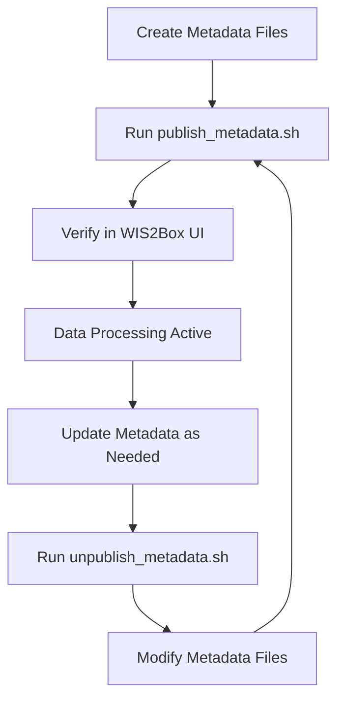

# Wis2box-data
This section documents the metadata management implementation for AODN's wis2box deployment, covering station metadata, discovery metadata, and data mappings as referenced in the [official wis2box documentation](https://docs.wis2box.wis.wmo.int/en/1.0.0/reference/running/concepts.html).

## Scripts Directory

The `scripts/` directory contains automation tools for managing WIS2Box metadata operations. These scripts provide a streamlined alternative to manual metadata management through the WIS2Box web interface.

### Script Overview

| Script | Purpose | Usage |
|--------|---------|-------|
| `publish_metadata.sh` | Publishes all metadata to WIS2Box catalogue | `./publish_metadata.sh` |
| `unpublish_metadata.sh` | Removes metadata from WIS2Box catalogue | `./unpublish_metadata.sh` |

### Prerequisites

Before using these scripts, ensure:

1. **WIS2Box Services Running**:
   ```bash
   cd ~/wis2box
   python3 wis2box-ctl.py start
   ```

2. **Container Access**: The `wis2box-management` container must be running and accessible

3. **Proper File Permissions**: Scripts must be executable
   ```bash
   chmod +x scripts/*.sh
   ```

### publish_metadata.sh

**Purpose**: Automates the publication of discovery metadata and station metadata to WIS2Box.

#### Features
- ✅ **Safety Checks**: Verifies WIS2Box management container is running
- 🎨 **Colored Output**: Color-coded status messages for better visibility
- 📊 **Progress Tracking**: Clear feedback on each operation
- 🔄 **Error Handling**: Robust error detection and reporting
- 📝 **Manual Instructions**: Fallback instructions for manual execution

#### Operations Performed

1. **Discovery Metadata Publication**:
   - Adds collections to API backend
   - Publishes metadata to the catalogue
   - Covers both Apollo Bay and Storm Bay datasets

2. **Station Metadata Publication**:
   - Publishes wave buoy station information
   - Associates stations with data collections

#### Usage

```bash
# Navigate to scripts directory
cd /mnt/efs-mount-point/wis2box-data/scripts/

# Execute the publishing script
./publish_metadata.sh
```

#### Sample Output

```
[INFO] Starting WIS2Box metadata publishing process...
[INFO] Publishing discovery metadata for Apollo Bay...
[SUCCESS] Apollo Bay metadata published successfully
[INFO] Publishing discovery metadata for Storm Bay...
[SUCCESS] Storm Bay metadata published successfully
[INFO] Publishing station metadata for wave buoys...
[SUCCESS] Wave buoy station metadata published successfully
[INFO] Metadata publishing process completed!
```

#### Manual Alternative

If automated execution fails, you can run commands manually:

```bash
# Login to management container
cd ~/wis2box
python3 wis2box-ctl.py login

# Inside the container, execute commands:
wis2box data add-collection /data/wis2box/metadata/discovery/wave-buoy-apollo-bay.yml
wis2box metadata discovery publish /data/wis2box/metadata/discovery/wave-buoy-apollo-bay.yml
```

### unpublish_metadata.sh

**Purpose**: Removes published metadata from WIS2Box catalogue and deletes associated collections.

#### Features
- ⚠️ **Safety Confirmation**: Requires explicit user confirmation before proceeding
- 🛡️ **Destructive Operation Warnings**: Clear warnings about irreversible actions
- 🔍 **Container Verification**: Ensures management container is available
- 📋 **Comprehensive Cleanup**: Removes both discovery and collection data
- 🎨 **Status Feedback**: Color-coded progress and error messages

#### Operations Performed

1. **Discovery Metadata Removal**:
   - Unpublishes metadata from catalogue
   - Deletes collections from API backend
   - Processes Apollo Bay and Storm Bay datasets

2. **Collection Cleanup**:
   - Removes data collections entirely

3. **Weather Metadata Removal**:
   - Currently does not support removing station metadata collections by commands
   - Must delete station metadata on wis2box-webapp manually with token.

#### Usage

```bash
# Navigate to scripts directory
cd wis2-pipeline/wis2box-data/scripts

# Execute the unpublishing script
./unpublish_metadata.sh
```

#### Interactive Confirmation

```
[WARNING] This will UNPUBLISH and DELETE metadata from WIS2Box!
[WARNING] This operation cannot be easily undone.

Are you sure you want to continue? (yes/no): yes
```

#### Sample Output

```
[INFO] Starting WIS2Box metadata unpublishing process...
[INFO] Unpublishing discovery metadata for Apollo Bay...
[SUCCESS] Apollo Bay metadata unpublished successfully
[INFO] Unpublishing discovery metadata for Storm Bay...
[SUCCESS] Storm Bay metadata unpublished successfully
[WARNING] Note: There is no direct 'unpublish-collection' command for station metadata.
[SUCCESS] Metadata unpublishing process completed!
```

### Error Handling

Both scripts include comprehensive error handling:

#### Common Error Scenarios

1. **Container Not Running**:
   ```
   [ERROR] wis2box-management container is not running!
   [WARNING] Please start WIS2Box services first: python3 wis2box-ctl.py start
   ```

2. **Metadata File Missing**:
   ```
   [ERROR] Failed to publish Apollo Bay metadata
   ```

3. **Permission Issues**:
   ```bash
   chmod +x scripts/*.sh  # Fix executable permissions
   ```

#### Troubleshooting

1. **Verify Container Status**:
   ```bash
   docker ps | grep wis2box-management
   ```

2. **Check File Paths**:
   - Ensure metadata files exist in expected locations
   - Verify file permissions and accessibility

3. **Manual Execution**:
   - Use provided manual instructions as fallback
   - Execute commands step-by-step for debugging

### Script Architecture

#### Color-Coded Output Functions

```bash
print_status()   # Blue [INFO] messages
print_success()  # Green [SUCCESS] messages
print_warning()  # Yellow [WARNING] messages
print_error()    # Red [ERROR] messages
```

#### Safety Features

- **Container verification** before attempting operations
- **User confirmation** for destructive operations
- **Exit on error** (`set -e`) for immediate failure detection
- **Detailed manual instructions** for troubleshooting

### Best Practices

#### Before Running Scripts

1. **Backup Configuration**: Ensure you can restore metadata if needed
2. **Test Environment**: Run in development environment first
3. **Verify Dependencies**: Confirm all required services are running

#### Monitoring Execution

1. **Watch Output**: Monitor color-coded messages for issues
2. **Verify Results**: Check WIS2Box web interface after completion
3. **Log Review**: Check container logs if operations fail

#### Regular Maintenance

1. **Update Scripts**: Keep scripts synchronized with metadata changes
2. **Test Regularly**: Verify scripts work with WIS2Box updates
3. **Document Changes**: Update this documentation when modifying scripts

### Integration with WIS2Box Workflow

These scripts integrate with the standard WIS2Box metadata management workflow:



For more information on metadata management concepts, see the sections above and refer to the official [wis2box documentation](https://docs.wis2box.wis.wmo.int/).
