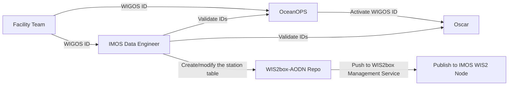

# WIS2Box Workshop Outline

## 1. Introduction
### 1.1 Introduction to WMO WIS2 system
1. What is WMO WIS2 system
2. Why WMO WIS2 system
3. How WMO WIS2 system works

### 1.2 Datasets published in WIS2

1. What datasets we published 
2. What is BUFR format
3. How to generate BUFR files from source data

## 2. Architecture of WIS2 SYSTEM
### 2.1 High Level Architecture

### 2.2 Publication of WIS2 Stations with WIGOS ID

