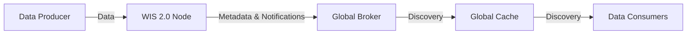
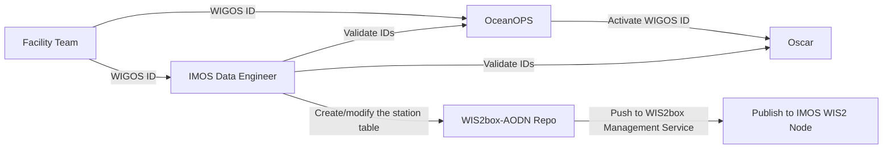
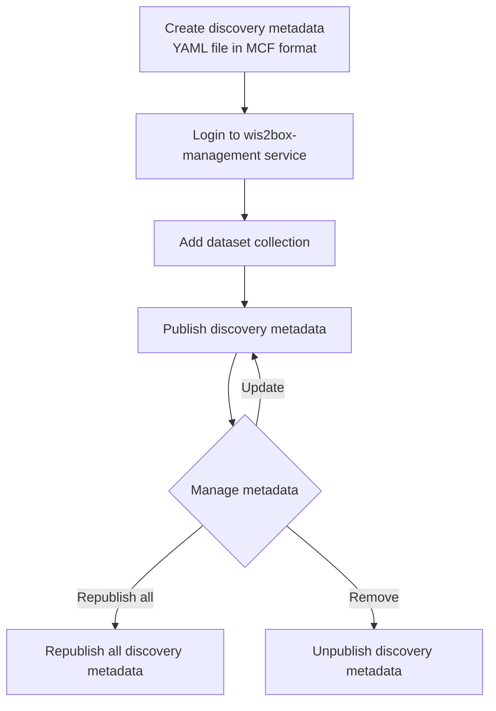

# WIS2Box Workshop Outline

## 1. Introduction
### 1.1 Introduction to WMO WIS2 system
1. What is WMO WIS2 system
2. Why WMO WIS2 system
3. How WMO WIS2 system works

### 1.2 Datasets published in WIS2

1. What datasets we published 
2. What is BUFR format
3. How to generate BUFR files from source data

## 2. Architecture of WIS2 SYSTEM
### 2.1 High Level Architecture

### 2.2 Publication Flow of WIS2 Stations with WIGOS ID

### 2.3 Publish Discovery Metadata via wis2box-management Service

This method publishes discovery metadata using a geo-YAML (MCF format) file, keeping the metadata in a persistent way.

#### Mapping IMOS Netcdf into WIS2 BUFR Format

#### Discovery Metadata (MCF geo-metadata format)

The discovery metadata YAML file defines the dataset collection and is stored in:
`wis2-pipeline/wis2box-data/metadata/discovery/wave-buoys.yml`

Key sections of the MCF file:
- **wis2box** — retention policy, topic hierarchy, data mappings (csv2bufr, bufr2geojson plugins)
- **mcf** — MCF schema version
- **metadata** — unique identifier (`urn:wmo:md:au-imos:wave-buoys`) and hierarchy level
- **identification** — title, abstract, keywords, spatial/temporal extents, WMO data policy
- **contact** — host organisation details (IMOS)

#### Publishing Workflow

