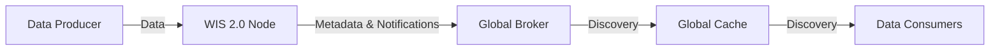
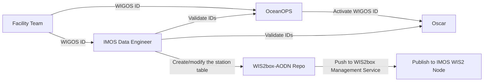
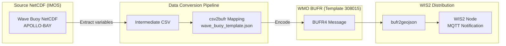
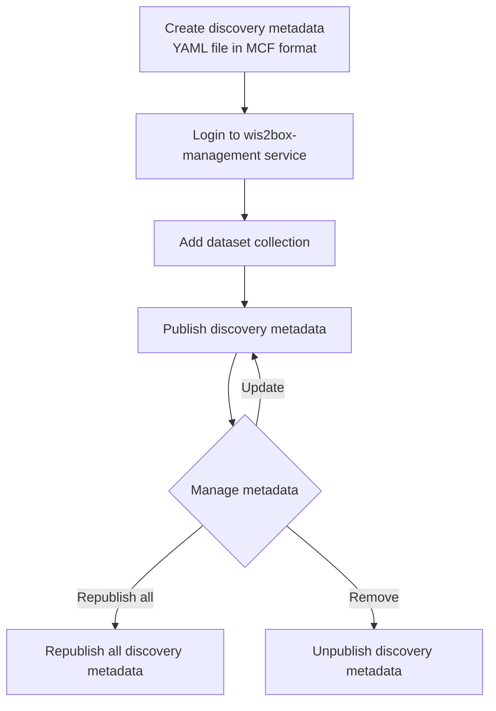

# WIS2Box Workshop Outline

## 1. Introduction
### 1.1 Introduction to WMO WIS2 system
1. What is WMO WIS2 system
2. Why WMO WIS2 system
3. How WMO WIS2 system works

### 1.2 Datasets published in WIS2

1. What datasets we published 
2. What is BUFR format
3. How to generate BUFR files from source data

## 2. Architecture of WIS2 SYSTEM
### 2.1 High Level Architecture

### 2.2 Publication Flow of WIS2 Stations with WIGOS ID

### 2.3 Publish Discovery Metadata via wis2box-management Service

This method publishes discovery metadata using a geo-YAML (MCF format) file, keeping the metadata in a persistent way.

#### Mapping IMOS NetCDF into WIS2 BUFR Format

Source: `IMOS/COASTAL-WAVE-BUOYS/WAVE-BUOYS/REALTIME/WAVE-PARAMETERS/APOLLO-BAY`

BUFR Template: **308015** (Wave buoy template)

##### Source NetCDF Variables

| NetCDF Variable | Standard Name | Long Name | Units |
|---|---|---|---|
| SSWMD | `sea_surface_wave_from_direction` | spectral sea surface wave mean direction | Degrees |
| WMDS | `sea_surface_wave_directional_spread` | spectral sea surface wave mean directional spread | Degrees |
| WPDI | `sea_surface_wave_from_direction_at_variance_spectral_density_maximum` | spectral peak wave direction | Degrees |
| WPDS | `sea_surface_wave_directional_spread_at_variance_spectral_density_maximum` | spectral sea surface wave peak directional spread | Degrees |
| WPFM | `sea_surface_wave_mean_period_from_variance_spectral_density_first_frequency_moment` | sea surface wave spectral mean period | s |
| WPPE | `sea_surface_wave_period_at_variance_spectral_density_maximum` | peak wave spectral period | s |
| WSSH | `sea_surface_wave_significant_height` | sea surface wave spectral significant height | m |
| WAVE_quality_control | — | primary Quality Control flag for wave variables | flag |

QC flag values follow **Ocean Data Standards, UNESCO 2013 (IOC Manuals and Guides, 54, Volume 3 Version 1)**:
`1=good, 2=not_evaluated, 3=questionable, 4=bad, 9=missing`

##### Wave Buoy Mapping Table (NetCDF → BUFR)

| NetCDF Name | WMO Table Ref | Element Name | Eccodes Key | Notes |
|---|---|---|---|---|
| SSWMD | 022086 | Mean direction from which waves are coming | `#1#meanDirectionFromWhichWavesAreComing` | |
| WMDS | 022187 | Directional spread of wave | `#1#directionalSpreadOfWaves` | Spread of "any wave" (022187) vs "dominant wave" (022077) |
| WPDI | 022076 | Direction from which dominant waves are coming | `#1#directionFromWhichDominantWavesAreComing` | Assumes peak wave ≈ dominant wave — needs verification |
| WPDS | 022077 | Directional spread of dominant wave | `#1#directionalSpreadOfDominantWave` | |
| WPFM | 022074 | Average wave period | `#1#averageWavePeriod` | WMO table lacks "spectral mean period" — assumes equivalent |
| WPPE | 022071 | Spectral peak wave period | `#1#spectralPeakWavePeriod` | |
| WSSH | 022070 | Significant wave height | `#1#significantWaveHeight` | |

Mapping template file: `wis2-pipeline/wis2box-data/mappings/wave_buoy_template.json`

#### Discovery Metadata (MCF geo-metadata format)

The discovery metadata YAML file defines the dataset collection and is stored in:
`wis2-pipeline/wis2box-data/metadata/discovery/wave-buoys.yml`

Key sections of the MCF file:
- **wis2box** — retention policy, topic hierarchy, data mappings (csv2bufr, bufr2geojson plugins)
- **mcf** — MCF schema version
- **metadata** — unique identifier (`urn:wmo:md:au-imos:wave-buoys`) and hierarchy level
- **identification** — title, abstract, keywords, spatial/temporal extents, WMO data policy
- **contact** — host organisation details (IMOS)

#### Publishing Workflow

